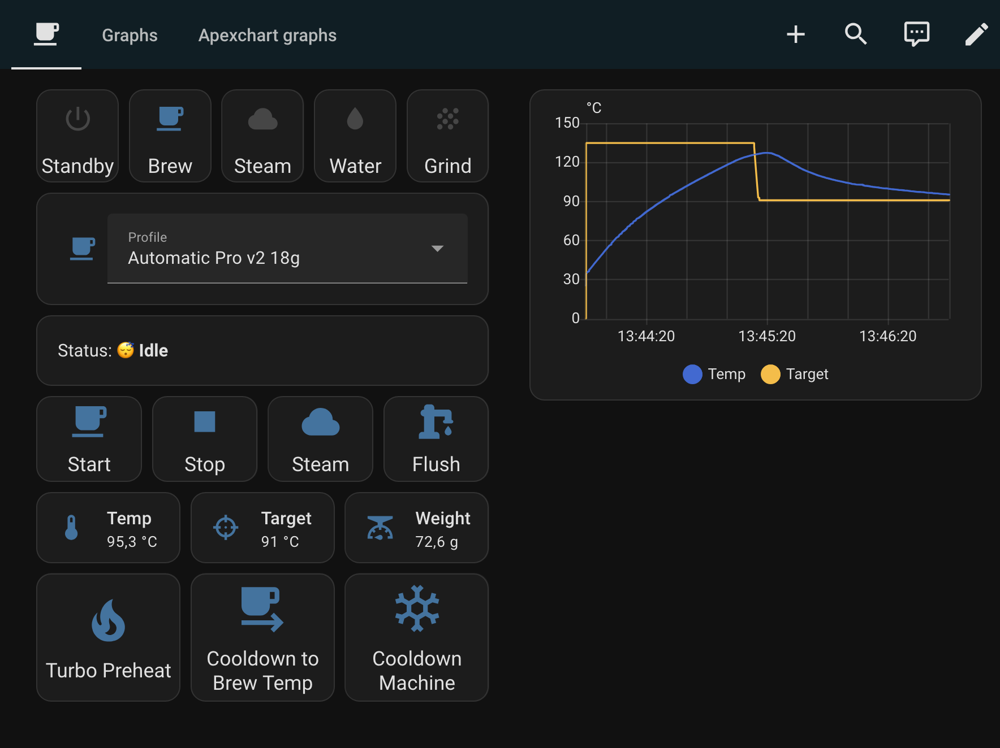

# GaggiMate Example Dashboard

An example Home Assistant dashboard for controlling and monitoring your GaggiMate espresso machine.

## Screenshots

### Control View

### Graphs View (built-in History Graph)

### ApexCharts View

## Prerequisites

### Required Scripts

The dashboard includes buttons that call three helper scripts. You must create these scripts in your Home Assistant configuration before the buttons will work. The full YAML for each script can be found in the [main README](../../README.md#example-scripts--automations):

- **`script.gaggimate_turbo_preheat`** — Rapidly preheats the machine by cycling into Steam mode and back to Brew mode once the target temperature is reached.
- **`script.gaggimate_cooldown_to_brew_temp`** — Cools the boiler back down to brew temperature by flushing water through the steam wand. Useful after steaming milk.
- **`script.gaggimate_cooldown`** — Fully cools down the machine by dispensing hot water until the boiler temperature drops below 30 °C.

Add these scripts to your `scripts.yaml` or via the Home Assistant UI under **Settings > Automations & Scenes > Scripts**.

## Graph Types

The dashboard includes two graph views so you can choose the one that fits your setup:

### Default Home Assistant History Graph (no extra dependencies)

The **"Graphs"** tab uses the built-in `history-graph` card. This works out of the box with any Home Assistant installation — no additional frontend components needed.

### ApexCharts (optional, recommended)

The **"Apexchart graphs"** tab uses the [ApexCharts Card](https://github.com/RomRider/apexcharts-card), a popular community card that provides more detailed and customizable real-time graphs with features like multiple Y-axes, dashed lines for target values, and color-coded series.

To use this tab, install the ApexCharts Card via [HACS](https://hacs.xyz/) or manually. If you don't install it, simply ignore or remove that tab from the dashboard.

## Installation

1. In Home Assistant, go to **Settings > Dashboards**.
2. Click **Add Dashboard** and choose a name (e.g. "GaggiMate").
3. Open the new dashboard, click the three-dot menu in the top right, and select **Edit Dashboard**.
4. Click the three-dot menu again and select **Raw configuration editor**.
5. Replace the contents with the YAML from [`gaggimate-dashboard.yaml`](gaggimate-dashboard.yaml).
6. Click **Save**.

> **Tip:** If you don't want the ApexCharts tab, delete the last view (titled "Apexchart graphs") from the YAML before saving.
